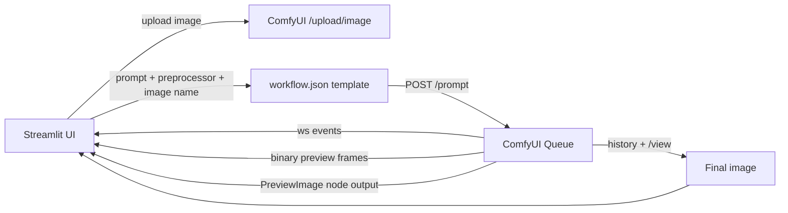

# Turbo ControlNet Engine

> Turn a rough reference image + a creative prompt into a controlled, client-ready visual — with live ControlNet structure previews.


<!-- Attach your UI screenshot as: docs/images/hero.png -->

[](https://www.python.org/)
[](https://streamlit.io/)
[](https://github.com/comfyanonymous/ComfyUI)
[]()

---

## What is this?

**Turbo ControlNet Engine** is a lightweight Streamlit front-end for a local **ComfyUI ControlNet workflow** based on **Z-Image-Turbo + Qwen**.

You provide:

1. A **reference image** — a sketch, 3D block-out, pose mockup, product staging photo, or location scout shot
2. A **natural-language prompt** — art direction, wardrobe, lighting, environment, mood, camera language
3. A **structure guide** — one of three AIO Aux preprocessors

The app uploads the reference to ComfyUI, runs the preprocessor, **shows the structure preview live while the job runs**, streams sampling progress, then displays and exports the **final generation**.

No ComfyUI graph editing. No manual file moves. Just direct → review → download.

```
Reference + Prompt + Preprocessor
        │
        ▼
ComfyUI: AIO Preprocessor → PreviewImage
        │
        ▼
Qwen DiffSynth ControlNet + Z-Image-Turbo sampling
        │
        ▼
Final image (view + download)
```

---

## Why this is useful for advertising and creative direction

Traditional AI image tools are great at vibes but terrible at **control**. This project keeps composition, pose, and staging intentional.

Use it for:

- **Campaign pre-visualization** — block a scene with simple 3D figures or a rough shoot, then render it photoreal in multiple styles before booking talent, sets, or locations.
- **Consistent characters and poses** — keep the same body language across a print series, storyboard, or key visuals while changing wardrobe, talent, lighting, or background.
- **Product and set staging** — preserve table height, product placement, and camera angle from a scout photo while restyling materials and environment.
- **Client pitches and treatments** — show a director's-boards-to-final look in minutes: reference → structure map → finished frame.
- **Look development** — test `cinematic daylight vs. warm editorial vs. night neon` on the exact same composition.
- **Team handoff** — art director locks composition with a preprocessor preview; copy, retouching, and production all work from the same controlled base.

> The preprocessor preview is the art-director checkpoint. If the lines / depth / pose look wrong there, the final will too — fix the reference early instead of re-rolling blindly.

---

## Key capabilities

- Reference image upload (`png`, `jpg`, `jpeg`, `webp`)
- Free-form creative prompt input
- One-click preprocessor switch:
  - `CannyEdgePreprocessor`
  - `DepthAnythingPreprocessor`
  - `OpenposePreprocessor`
- Live preprocessor preview during generation
- Real-time ComfyUI progress and stage status
- Final image display + one-click PNG download
- Preset Z-Image-Turbo ControlNet workflow stored as versioned `workflow.json`
- Local-first — images stay on your machine and your ComfyUI instance


<!-- Attach your app screenshot as: docs/images/ui-overview.png -->

---

## How it works

### App flow



### Workflow mapping

The bundled `workflow.json` is the source of truth. The app only rewrites these fields per run:

| Node | Purpose | What the app sets |
|------|---------|-------------------|
| `50 LoadImage` | Reference image | Uploaded filename |
| `56 AIO Aux Preprocessor` | Structure guide | `CannyEdgePreprocessor`, `DepthAnythingPreprocessor`, or `OpenposePreprocessor` |
| `45 CLIP Text Encode` | Creative direction | Prompt text |
| `9 SaveImage` | Output naming | Unique `turbo/<run_id>` prefix |
| `57 PreviewImage` | Live structure preview | Read back through WebSocket + `/view` |

All model, sampler, ControlNet, and resolution settings remain exactly as defined in your ComfyUI graph.

---

## Example: one reference, three directions

> Replace the placeholders below with your own exports. Keep the filenames so the README renders automatically.

Reference input:


<!-- Attach as: docs/images/example-reference.png -->

Prompt used for all three examples:

```text
A photorealistic, highly detailed 8k cinematic shot of a young woman and a young man
in a modern, sunlit office. In the foreground on the right, a young woman is leaning
casually backward against the front edge of a wooden desk. In the background on the
left, a young man sits behind the desk in a light blue button-down shirt. Stylish
study room, soft warm sunlight, soft shadows, sharp focus, masterpiece.
```

### 1. Canny Edge — best for exact composition

Preserves strong outlines, furniture edges, and figure placement.

| Preprocessor preview | Final output |
|---|---|
|  <!-- Attach as: docs/images/example-canny-preview.png --> |  <!-- Attach as: docs/images/example-canny-final.png --> |

Use when: you already like the blocking and want a faithful restyle.

### 2. DepthAnything — best for space and staging

Preserves depth ordering, foreground/background separation, and room volume.

| Preprocessor preview | Final output |
|---|---|
|  <!-- Attach as: docs/images/example-depth-preview.png --> |  <!-- Attach as: docs/images/example-depth-final.png --> |

Use when: product placement, set depth, or camera perspective matters more than line detail.

### 3. OpenPose — best for talent and body language

Preserves human skeletons, head position, limb direction, and interaction.

| Preprocessor preview | Final output |
|---|---|
|  <!-- Attach as: docs/images/example-openpose-preview.png --> |  <!-- Attach as: docs/images/example-openpose-final.png --> |

Use when: casting, posing, or multi-person interaction is the hero of the layout.

### What to compare

- Does the desk angle stay consistent?
- Do the two figures keep their foreground/background relationship?
- Which preprocessor gives cleaner hands, faces, and furniture?
- Which final best matches your brand lighting and wardrobe brief?

---

## Technologies used

| Layer | Technology |
|---|---|
| Frontend | [Streamlit](https://streamlit.io/) |
| Backend / orchestration | [ComfyUI](https://github.com/comfyanonymous/ComfyUI) API + WebSocket |
| Image model | `z_image_turbo_bf16.safetensors` |
| Text encoder | `qwen_3_4b.safetensors` |
| VAE | `ae.safetensors` |
| ControlNet | `Z-Image-Turbo-Fun-Controlnet-Union.safetensors` via `QwenImageDiffsynthControlnet` |
| Structure guides | ComfyUI ControlNet Aux — `AIO_Preprocessor` |
| HTTP client | `requests` |
| Live updates | `websocket-client` |
| Image handling | `Pillow` |
| Environment | Python `venv`, Git |

Required ComfyUI custom nodes:

- `comfyui_controlnet_aux` — provides `AIO_Preprocessor`
- Crystools or equivalent — provides `Get resolution [Crystools]`

---

## Requirements

- Windows + Python 3.13
- ComfyUI running locally, for example:

```text
http://127.0.0.1:8188
```

- All models referenced in `workflow.json` installed in ComfyUI
- Ports available for Streamlit, default `8501`

---

## Quickstart

```powershell
# 1. Go to the project
cd C:\Games\turbo-controlnet-engine

# 2. Activate the environment
.\.venv\Scripts\Activate.ps1

# 3. Start the app
streamlit run app.py
```

Then open the displayed local URL, usually:

```text
http://localhost:8501
```

### Using the app

1. Upload a reference image.
2. Write or paste your prompt.
3. Choose:
   - `CannyEdgePreprocessor`
   - `DepthAnythingPreprocessor`
   - `OpenposePreprocessor`
4. Click **Generate image**.
5. Watch the **Live / Preprocessor Output** panel first.
6. Wait for sampling progress to complete.
7. Review the **Final / Generated Image** panel.
8. Click **Download generated image**.

---

## Project structure

```text
C:\Games\turbo-controlnet-engine
├── app.py            # Streamlit UI + ComfyUI API / WebSocket integration
├── workflow.json     # Versioned ComfyUI workflow template
├── requirements.txt  # Python dependencies
├── README.md         # This file
├── docs/
│   └── images/       # Screenshots and example outputs used above
├── .venv/            # Local virtual environment, not committed
└── .gitignore
```

---

## Adding your images

Drop files into `docs/images/` using these exact names:

```text
docs/images/hero.png
docs/images/ui-overview.png
docs/images/example-reference.png
docs/images/example-canny-preview.png
docs/images/example-canny-final.png
docs/images/example-depth-preview.png
docs/images/example-depth-final.png
docs/images/example-openpose-preview.png
docs/images/example-openpose-final.png
```

Recommended export sizes:

- UI screenshots: `1600px` wide
- Reference and finals: original generation resolution
- Previews: as returned by ComfyUI, no upscale needed

---

## Customization

- Change the default ComfyUI address in the sidebar or `DEFAULT_COMFY_URL` in `app.py`.
- Change preprocessor resolution in `workflow.json`, node `56`, field `resolution`.
- Change sampler steps, CFG, seed, or ControlNet strength in nodes `49`, `67`, and `68`.
- Add more preprocessors by extending `PREPROCESSORS` in `app.py`.
- The current workflow uses a two-stage `KSamplerAdvanced` pass for quality and control.

---

## Troubleshooting

| Symptom | Likely cause | Fix |
|---|---|---|
| Cannot connect to ComfyUI | ComfyUI is not running | Start ComfyUI and verify `http://127.0.0.1:8188/system_stats` |
| Missing model error | Required checkpoint, CLIP, VAE, or ControlNet not installed | Install the filenames listed in Technologies Used |
| Missing node error | Custom node not installed | Install ControlNet Aux and Crystools, restart ComfyUI |
| No preview appears | Proxy stripped binary WebSocket frames | The app already falls back to the `PreviewImage` node output; check ComfyUI logs |
| Generation is slow | First run loads models | Keep ComfyUI warm; reduce preprocessor resolution or sampler steps |
| Streamlit page is blank | Wrong Python environment | Activate `.venv` before running `streamlit run app.py` |

---

## Roadmap ideas

- Negative prompt and seed controls
- Side-by-side comparison mode for all three preprocessors
- Batch generation and contact-sheet export
- Preset prompt library for automotive, fashion, F&B, and retail briefs
- Automatic saving of reference + preview + final triples for client decks

---

## License

Internal creative-tooling project. Add your preferred license here before sharing outside your team.
