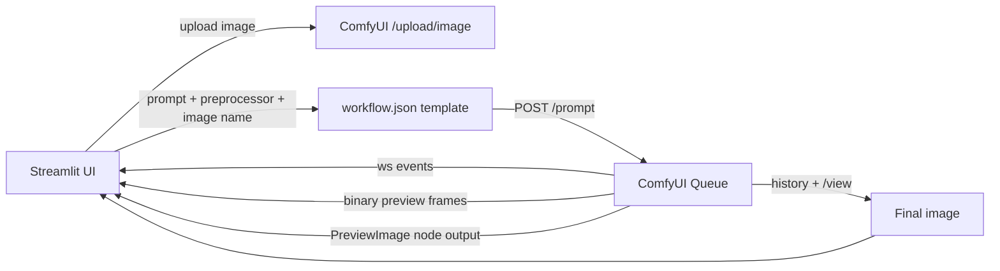
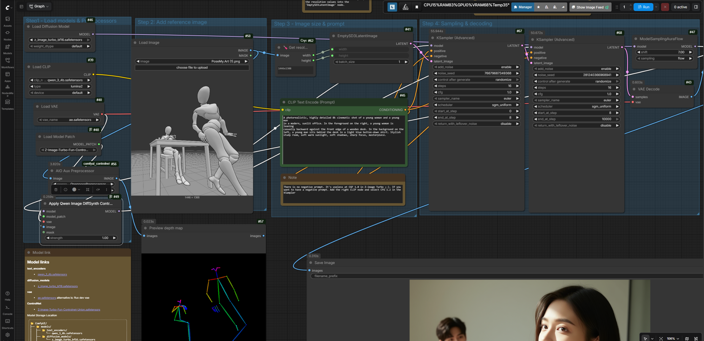
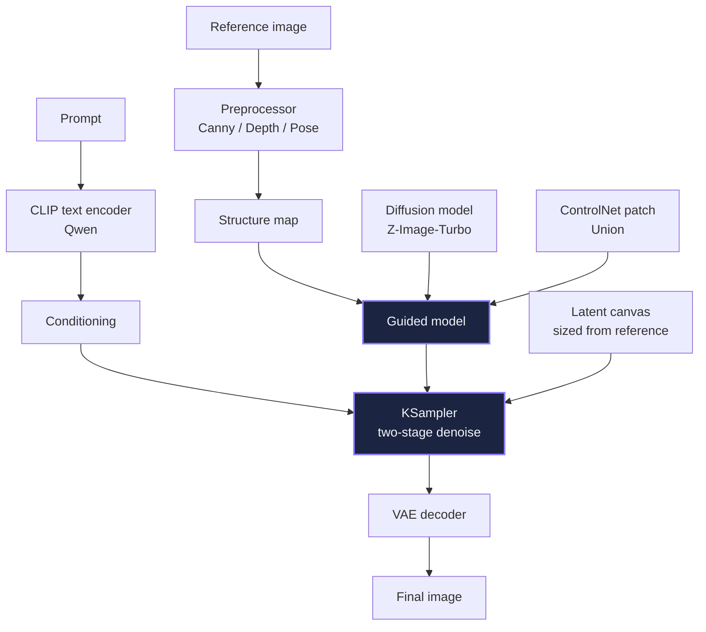
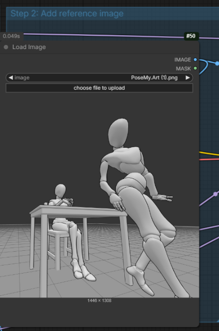
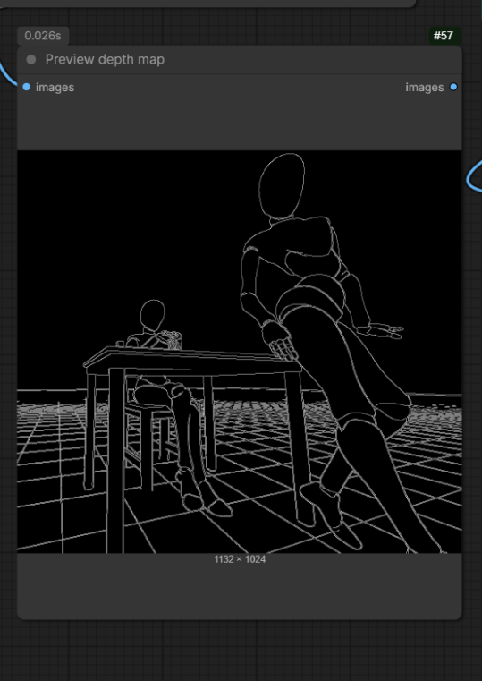
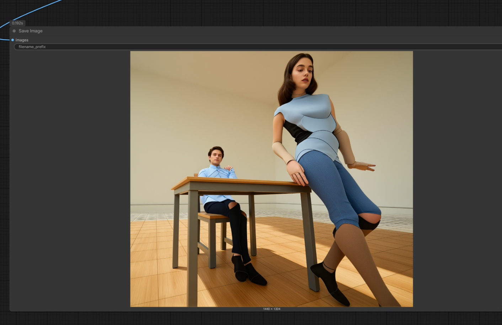
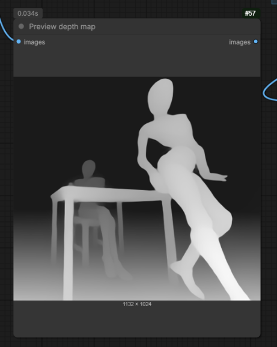
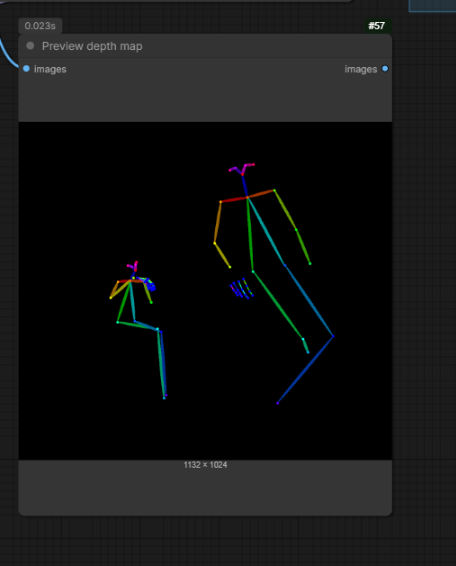

# Turbo ControlNet Engine

> Turn a rough reference image + a creative prompt into a controlled, client-ready visual — with live ControlNet structure previews.


<!-- Attach your UI screenshot as: docs/images/hero.png -->

[](https://www.python.org/)
[](https://streamlit.io/)
[](https://github.com/comfyanonymous/ComfyUI)
[]()

---

## What is this?

**Turbo ControlNet Engine** is a local **ComfyUI ControlNet workflow** based on **Z-Image-Turbo + Qwen** with preprocessors and Streamlit front-end .

You provide:

1. A **reference image** — a sketch, 3D block-out, pose mockup, product staging photo, or location scout shot
2. A **natural-language prompt** — art direction, wardrobe, lighting, environment, mood, camera language
3. A **structure guide** — one of three AIO Aux preprocessors

The app uploads the reference to ComfyUI, runs the preprocessor, **shows the structure preview live while the job runs**, streams sampling progress, then displays and exports the **final generation**.

No ComfyUI graph editing. No manual file moves. Just direct → review → download.

```
Reference + Prompt + Preprocessor
        │
        ▼
ComfyUI: AIO Preprocessor → PreviewImage
        │
        ▼
Qwen DiffSynth ControlNet + Z-Image-Turbo sampling
        │
        ▼
Final image (view + download)
```

---

## Why this is useful for advertising and creative direction

Traditional AI image tools are great at vibes but terrible at **control**. This project keeps composition, pose, and staging intentional.

Use it for:

- **Campaign pre-visualization** — block a scene with simple 3D figures or a rough shoot, then render it photoreal in multiple styles before booking talent, sets, or locations.
- **Consistent characters and poses** — keep the same body language across a print series, storyboard, or key visuals while changing wardrobe, talent, lighting, or background.
- **Product and set staging** — preserve table height, product placement, and camera angle from a scout photo while restyling materials and environment.
- **Client pitches and treatments** — show a director's-boards-to-final look in minutes: reference → structure map → finished frame.
- **Look development** — test `cinematic daylight vs. warm editorial vs. night neon` on the exact same composition.
- **Team handoff** — art director locks composition with a preprocessor preview; copy, retouching, and production all work from the same controlled base.

> The preprocessor preview is the art-director checkpoint. If the lines / depth / pose look wrong there, the final will too — fix the reference early instead of re-rolling blindly.

---

## Key capabilities

- Reference image upload (`png`, `jpg`, `jpeg`, `webp`)
- Free-form creative prompt input
- One-click preprocessor switch:
  - `CannyEdgePreprocessor`
  - `DepthAnythingPreprocessor`
  - `OpenposePreprocessor`
- Live preprocessor preview during generation
- Real-time ComfyUI progress and stage status
- Final image display + one-click PNG download
- Preset Z-Image-Turbo ControlNet workflow stored as versioned `workflow.json`
- Local-first — images stay on your machine and your ComfyUI instance


<!-- Attach your app screenshot as: docs/images/ui-overview.png -->

---

## How it works

### App flow



### Workflow mapping

The bundled `workflow.json` is the source of truth. The app only rewrites these fields per run:

| Node | Purpose | What the app sets |
|------|---------|-------------------|
| `50 LoadImage` | Reference image | Uploaded filename |
| `56 AIO Aux Preprocessor` | Structure guide | `CannyEdgePreprocessor`, `DepthAnythingPreprocessor`, or `OpenposePreprocessor` |
| `45 CLIP Text Encode` | Creative direction | Prompt text |
| `9 SaveImage` | Output naming | Unique `turbo/<run_id>` prefix |
| `57 PreviewImage` | Live structure preview | Read back through WebSocket + `/view` |

All model, sampler, ControlNet, and resolution settings remain exactly as defined in your ComfyUI graph. The full graph is documented in the next section.

---

## The ComfyUI workflow — the core of this project

The Streamlit app is a remote control. The actual image-making happens in the ComfyUI graph below, which is versioned in this repo as `workflow.json`. Understanding it is what lets you art-direct results instead of re-rolling blindly.


<!-- Save the attached ComfyUI screenshot as: docs/images/comfyui-workflow.png -->

The canvas is organized into five labeled groups that run left to right:

| Group | Role in one sentence |
|---|---|
| Step 1 — Load models & Preprocessors | Loads the diffusion model, text encoder, VAE, ControlNet patch, and fuses them into one guided model |
| Step 2 — Add reference image | Loads your reference, extracts its structure map, and shows the live preview |
| Step 3 — Image size & prompt | Sizes the latent canvas from the reference and encodes your creative direction |
| Step 4 — Sampling & decoding | Denoises in two hand-off stages, then decodes to pixels |
| Step 5 — Filters & editing (optional) | Post-processing, disabled by default — safe to ignore or delete |

### How the pieces flow together

One big-picture view: the preprocessor supplies structure, CLIP supplies meaning, the diffusion model supplies the imagery, the KSampler brings them together on a latent canvas, and the VAE turns the result into pixels.



### Step-by-step walkthrough

**Step 1 — Load models & Preprocessors (nodes 46, 47, 39, 40, 48, 49).**
Four loaders bring in the four model files (table below). `ModelSamplingAuraFlow` (node 47, shift 7) tunes the flow-matching schedule for Z-Image-Turbo. Then `QwenImageDiffsynthControlnet` (node 49, strength 1) fuses the diffusion model, the ControlNet Union patch, the VAE, and the preprocessor's structure image into a single guided model. Everything downstream samples from this fused model — this is where "control" physically enters the generation.

**Step 2 — Add reference image (nodes 50, 56, 57).**
`LoadImage` (node 50) reads the reference the app uploaded. `AIO_Preprocessor` (node 56, resolution 1024) converts it into a structure map using whichever preprocessor you picked — Canny edges, DepthAnything depth, or OpenPose skeleton. That map feeds the ControlNet input of node 49, and `PreviewImage` (node 57) exposes the same map so the app can show it live. This preview is your art-director checkpoint: if the structure looks wrong here, fix the reference instead of burning sampling time.

**Step 3 — Image size & prompt (nodes 62, 41, 45, 42).**
`Get resolution` (node 62) reads the reference dimensions and drives `EmptySD3LatentImage` (node 41), so the output canvas matches your reference's aspect ratio automatically. `CLIP Text Encode` (node 45) turns your prompt into positive conditioning via the Qwen encoder, and `ConditioningZeroOut` (node 42) derives the negative conditioning from it. Per the note on the canvas, there is effectively no negative prompt at CFG 1.0 — adding a real negative requires a full CLIP setup and CFG above 1.0.

**Step 4 — Sampling & decoding (nodes 67, 68, 43, 9).**
Two `KSamplerAdvanced` nodes split denoising into a hand-off: stage 1 (node 67) runs steps 0→8 laying in composition, stage 2 (node 68) continues from step 8 to finish detail. Both use euler / sgm_uniform at CFG 1. `VAEDecode` (node 43) converts the finished latent to pixels, and `SaveImage` (node 9) writes it under a unique per-run prefix the app later fetches. The two rules on the canvas are load-bearing: keep total steps identical on both samplers (16 and 16), and sampler 1's END step must equal sampler 2's START step (8 and 8).

**Step 5 — Filters & editing, optional (disabled).**
The red-boxed node is a private post-processing node that ships disabled — it contributes nothing to the API run. Tune it in the ComfyUI UI if you want it, or delete it; the workflow runs fine without it.

### Model files and where they live

Install these into your ComfyUI `models/` folders as shown in the graph's Model links note:

| File | Loader node | ComfyUI folder |
|---|---|---|
| `qwen_3_4b.safetensors` | 39 CLIPLoader | `models/text_encoders/` |
| `z_image_turbo_bf16.safetensors` | 46 UNETLoader | `models/diffusion_models/` |
| `ae.safetensors` | 40 VAELoader | `models/vae/` |
| `Z-Image-Turbo-Fun-Controlnet-Union.safetensors` | 48 ModelPatchLoader | `models/` ControlNet folder per the graph note |

Required custom nodes: `comfyui_controlnet_aux` (AIO Preprocessor) and Crystools (Get resolution).

### Rules to preserve when editing the graph

- **Sampler hand-off:** total steps equal on nodes 67 and 68; node 67 `end_at_step` = node 68 `start_at_step`.
- **Resolution:** `Get resolution` (node 62) auto-matches the reference; per the canvas tip you may delete it and type width/height into node 41 manually instead.
- **CFG stays at 1:** the Turbo model is tuned for it; raising CFG without adding a real negative-prompt path degrades results.
- **Preprocessor resolution 1024** on node 56 is the detail-vs-VRAM tradeoff; lower it if a weak GPU runs out of memory.

---

## Example: one reference, three directions

> Replace the placeholders below with your own exports. Keep the filenames so the README renders automatically.

Reference input:


<!-- Attach as: docs/images/example-reference.png -->

Prompt used for all three examples:

```text
A photorealistic, highly detailed 8k cinematic shot of a young woman and a young man
in a modern, sunlit office. In the foreground on the right, a young woman is leaning
casually backward against the front edge of a wooden desk. In the background on the
left, a young man sits behind the desk in a light blue button-down shirt. Stylish
study room, soft warm sunlight, soft shadows, sharp focus, masterpiece.
```

### 1. Canny Edge — best for exact composition

Preserves strong outlines, furniture edges, and figure placement.

| Preprocessor preview | Final output |
|---|---|
|  <!-- Attach as: docs/images/example-canny-preview.png --> |  <!-- Attach as: docs/images/example-canny-final.png --> |

Use when: you already like the blocking and want a faithful restyle.

### 2. DepthAnything — best for space and staging

Preserves depth ordering, foreground/background separation, and room volume.

| Preprocessor preview | Final output |
|---|---|
|  <!-- Attach as: docs/images/example-depth-preview.png --> |  <!-- Attach as: docs/images/example-depth-final.png --> |

Use when: product placement, set depth, or camera perspective matters more than line detail.

### 3. OpenPose — best for talent and body language

Preserves human skeletons, head position, limb direction, and interaction.

| Preprocessor preview | Final output |
|---|---|
|  <!-- Attach as: docs/images/example-openpose-preview.png --> |  <!-- Attach as: docs/images/example-openpose-final.png --> |

Use when: casting, posing, or multi-person interaction is the hero of the layout.

### What to compare

- Does the desk angle stay consistent?
- Do the two figures keep their foreground/background relationship?
- Which preprocessor gives cleaner hands, faces, and furniture?
- Which final best matches your brand lighting and wardrobe brief?

---

## Technologies used

| Layer | Technology |
|---|---|
| Frontend | [Streamlit](https://streamlit.io/) |
| Backend / orchestration | [ComfyUI](https://github.com/comfyanonymous/ComfyUI) API + WebSocket |
| Image model | `z_image_turbo_bf16.safetensors` |
| Text encoder | `qwen_3_4b.safetensors` |
| VAE | `ae.safetensors` |
| ControlNet | `Z-Image-Turbo-Fun-Controlnet-Union.safetensors` via `QwenImageDiffsynthControlnet` |
| Structure guides | ComfyUI ControlNet Aux — `AIO_Preprocessor` |
| HTTP client | `requests` |
| Live updates | `websocket-client` |
| Image handling | `Pillow` |
| Environment | Python `venv`, Git |

Required ComfyUI custom nodes:

- `comfyui_controlnet_aux` — provides `AIO_Preprocessor`
- Crystools or equivalent — provides `Get resolution [Crystools]`

---

## Requirements

- Windows + Python 3.13
- ComfyUI running locally, for example:

```text
http://127.0.0.1:8188
```

- All models referenced in `workflow.json` installed in ComfyUI
- Ports available for Streamlit, default `8501`

---

## Quickstart

```powershell
# 1. Go to the project
cd C:\Games\turbo-controlnet-engine

# 2. Activate the environment
.\.venv\Scripts\Activate.ps1

# 3. Start the app
streamlit run app.py
```

Then open the displayed local URL, usually:

```text
http://localhost:8501
```

### Using the app

1. Upload a reference image.
2. Write or paste your prompt.
3. Choose:
   - `CannyEdgePreprocessor`
   - `DepthAnythingPreprocessor`
   - `OpenposePreprocessor`
4. Click **Generate image**.
5. Watch the **Live / Preprocessor Output** panel first.
6. Wait for sampling progress to complete.
7. Review the **Final / Generated Image** panel.
8. Click **Download generated image**.

---

## Project structure

```text
C:\Games\turbo-controlnet-engine
├── app.py            # Streamlit UI + ComfyUI API / WebSocket integration
├── workflow.json     # Versioned ComfyUI workflow template
├── requirements.txt  # Python dependencies
├── README.md         # This file
├── docs/
│   └── images/       # Screenshots and example outputs used above
├── .venv/            # Local virtual environment, not committed
└── .gitignore
```

---


## License

Internal creative-tooling project.
